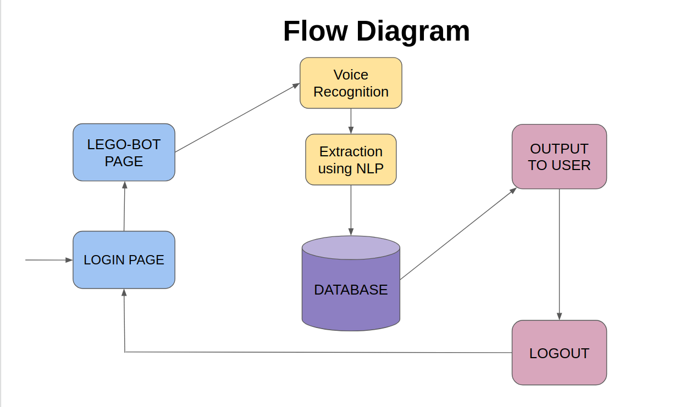

## Team LEGOS - LEGO VOICE ASSISTANT

### Project Overview
----------------------------------

**Problem Statement:** CONVERSATIONAL APP INTEGRATION WITH THE CORE PRODUCT USING TECHNOLOGY

**Approach:**

Our aim was to code a voice assistant that accepts a voice input, and outputs the required result after searching the database.

To facilitate speech recognition and synthesis we used the HTML5 Speech Recognition API.

For our rudimentry model we used a CSV file to store our data and used it as our database.

The required data was extracted from the query by tokenizing it. We used NLP (Natural Language Processing) to match the keywords with the data from the database and displayed it to the user.
 

### Solution Description
----------------------------------

Check out the [website](https://lego-voice--assistant.herokuapp.com/).

#### Architecture Diagram

#### Technical Description

**Technologies Used:**

**Frontend**: HTML, CSS, JavaScript

**Backend**: Python, Flask

**Libraries**: Pandas, Spacy, Requests, JQuery, Bootstrap

**APIs** : HTML5 Speech Recognition API

**Setup/Installations:**

pip install Flask\
pip install spacy\
python -m spacy download en_core_web_sm\
python -m spacy link en_core_web_sm en\
pip install jsonlib\
pip install pandas\
pip install Flask-Flash

*Latest versions of all libraries.*

**Steps to run the code:**

1. Open the command prompt (Terminal or Shell) and navigate to the root directory of project.
2. Execute python app.py to launch the web-app.
3. Go to http://localhost:5000 to view and utilise the web-app.

### Team Members
----------------------------------

1. **Smriti Suresh - smriti18557@mechyd.ac.in**

* Extracting required data from the query given by the user by tokenizing. 
* Used NLP to match required data from database.
 
2. **Sakshi Reddy Methkupally - sakshi18549@mechyd.ac.in**

* Extracted the query from the audio response.
* Passed data extracted from the database to the front end and displayed it.
 
3. **Vinuthna Ghattamaneni - vinuthna18566@mechyd.ac.in**

* Designed Login and Query web pages.
* Implemented the voice input and output in the UI.
 
4. **Bogireddy Neha Reddy - neha18509@mechyd.ac.in**

* Validation of login using the database.
* Integration with the query page using flask.
* Logout by redirecting back to the login page.

5. **Chada Venkata Sai Poorna Tushara - poorna18511@mechyd.ac.in**

* Coded Voice Recognition part in python and helped for writing its code in HTML.
* Managed the Database 
* Designed Chat display box.

